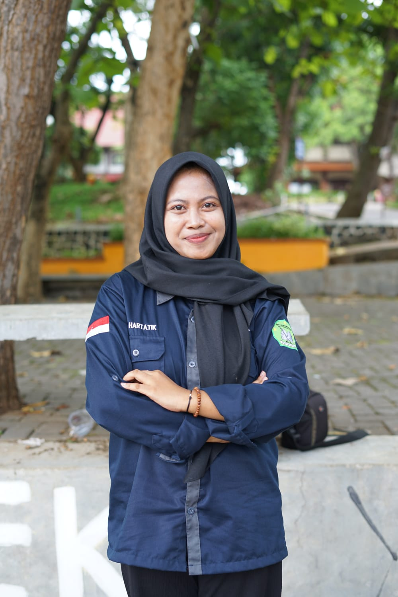

<!DOCTYPE html>
<html>
<head>
<title>BIODATA TITIK HARTATIK</title>
</head>
<body>
<h1 align="center">BIODATA TITIK HARTATIK</h1>
<table width="745" border="1" cellspacing="0" cellpadding="5" align="center">
<td>FOTO</td>
<td> </td>

</tr>
<tr>
<td>NAMA</td>
<td>TITIK HARTATIK</td>
</tr>
<tr>
<td>TTL</td>
<td>Pati,02 Oktober 2005</td>
</tr>
<tr>
  <td>AGAMA</td>
  <td><input type="checkbox" id="vehicle1" name="vehicle1" value="Agama 1">
    <label for="vehicle1"> Islam</label> 
    <input type="checkbox" id="vehicle2" name="vehicle2" value="Agama 2">
    <label for="vehicle1"> Katolik</label> 
    <input type="checkbox" id="vehicle2" name="vehicle2" value="Agama 3">
    <label for="vehicle2"> Kristen</label> 
    <input type="checkbox" id="vehicle3" name="vehicle3" value="Agama 4">
    <label for="vehicle3"> Hindu</label> 
    <input type="checkbox" id="vehicle1" name="vehicle1" value="Agama 5">
    <label for="vehicle1"> Budha</label> 
    <input type="checkbox" id="vehicle2" name="vehicle2" value="Agama 6">
    <label for="vehicle2"> Khonghucu</label> 
      </select>
      </form></td>
  </tr>
<tr>
<td>JENIS KELAMIN</td>
<td><form action="proses.php" method="get">
    <select name='jenis kelamin'>
      <option value='Perempuan'>Perempuan</option>
      <option value='Laki-Laki'>Laki-Laki</option>
    </select></form></td>
</tr>
<tr>
<td>PEKERJAAN</td>
<td>Mahasiswa</td>
</tr>
<tr>
  <td>Hobi</td>
  <td>
    <ol>
      <li>Membaca
      <ol>
          <li>Novel</li>
          <li>Artikel</li>
          </ol>
      <li>Travelling
      <ol>
          <li>Pantai, alam</li>
          <li>Danau, laut</li>
          </ol>
      <li>Mendengarkan lagu
      <ol>
          <li>Lagu inggris</li>
          <li>Lagu jawa</li>
          </ol>
    </ol>
  </select>
  <tr>
<td>Motivasi</td>
<td><ul>
    <li>Membuat persepsi positif terhadap karya sendiri dapat
       membantu meningkatkan motivasi membaca </li>
    <li>Menantang diri sendiri untuk menjelajahi dunia, dan memotivasi untuk menjaga alam </li>
    <li>Mendengarkan lagu membuat diri relax </li>
</ul></td>
</tr>
<tr>
<td>NIM</td>
<td>23030360056</td>
</tr>
<tr>
<td>Kelas</td>
<td>2 B</td>
</tr>
tr>
<td>Jurusan</td>
<td> <input type="radio" id="PAI" name="fav_language" value="PAI">
  <label for="PAI">PAI</label> 
  <input type="radio" id="MPI" name="fav_language" value="MPI">
  <label for="MPI">MPI</label> 
  <input type="radio" id="PBA" name="fav_language" value="PBA">
  <label for="PBA">PBA</label>
  <input type="radio" id="PBI" name="fav_language" value="PBI"> 
  <label for="PBI">PBI</label> 
  <input type="radio" id="PIAUD" name="fav_language" value="PIAUD">
  <label for="PIAUD">PIAUD</label> 
  <input type="radio" id="PGMI" name="fav_language" value="PGMI">
  <label for="PGMI">PGMI</label></td>
</tr>
<tr>
<td>Kuliah</td>
<td>UIN Walisongo</td>
</tr>
<tr>
<td>Phone</td>
<td>081997900035</td>
</tr>
<tr>
<td>Email</td>
<td>titikhartatik92@gmail.com</td>
</tr>
<tr>
<td>Deskripsi Diri</td>
<td>Saya sedang menjalani kuliah di jurusan manajemen pendidikan islam, dan saya berfokus pada jurusan saya agar tujuan saya dimasa depan tercapai sesuai yang diharapkan.  </td>
</tr>
</table>
</body>
</html>
